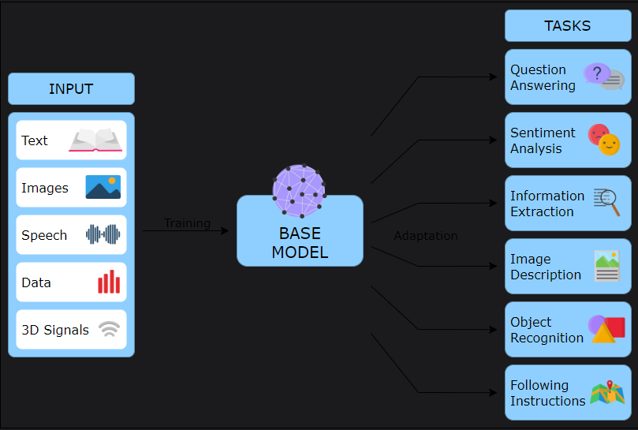
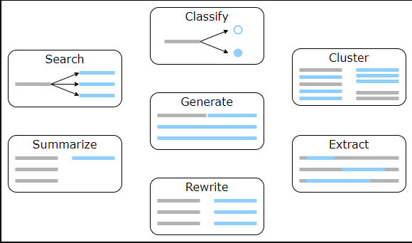
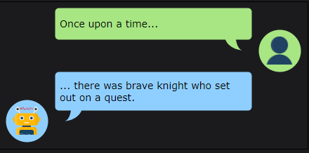
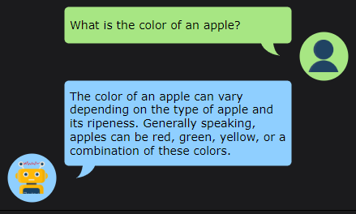

# Üretken Yapay Zekâ

Üretken yapay zekâyı ve büyük dil modellerini öğrenin — bu alan, istem mühendisliğinin (prompt engineering) temelini oluşturur.

**Üretken yapay zekâ nedir?**  
Daha önce de tartıştığımız gibi, üretken yapay zekâ; metin, görsel, ses, video ve sentetik veri gibi çeşitli yeni içerikler üreten bir yapay zekâ teknolojisidir. Mevcut verileri kullanarak karar veren diğer yapay zekâ türlerinden farklı olarak, üretken yapay zekâ, girdi verilerindeki kalıpları ve ilişkileri öğrenir ve yeni, özgün veriler üretir.

Üretken Yapay Zekâ, metin, görsel, video veya müzik notaları gibi yapay zekâ sisteminin yorumlayabileceği çeşitli girdiler şeklinde bir komut (prompt) gerektirir. Daha sonra, farklı yapay zekâ algoritmaları bu komuta yanıt olarak yeni içerikler üretir. Ortaya çıkan içerikler; denemeler, problemlere verilen yanıtlar, ya da komuta bağlı olarak görseller ve videolar olabilir. İnsan yaratıcılığını taklit eden karmaşık ve gerçekçi içerikler oluşturur. Bu özelliği, onu oyun, eğlence ve ürün tasarımı gibi birçok sektör için değerli bir araç hâline getirir.

### Üretken Yapay Zekâ Model Türleri

Farklı üretken yapay zekâ modelleri, belirli görevleri yerine getirmek için tasarlanmıştır. En popüler türler şunlardır:

**Varyasyonel Otokodlayıcılar (VAEs):** Bu, giriş verisinin sıkıştırılmış bir temsili olan “gizli uzayı” (latent space) öğrenen bir tür sinir ağıdır. Daha sonra bu gizli uzaydan örnekleme yaparak yeni örnekler üretebilir.

**Üretken Rekabetçi Ağlar (GANs):** GAN’lar, verilen bir veri kümesine benzer yeni veriler üretebilen bir sinir ağı türüdür. GAN’lar, üretici ağın veri örnekleri oluşturduğu ve ayırt edici ağın bu örnekleri değerlendirerek gerçek mi sahte mi olduğunu belirlediği rekabetçi bir süreçle eğitilir. Üretici ağ, ayırt ediciyi kandırmaya çalışarak gerçekçi veriler üretme yeteneğini geliştirir. Ayırt edici ağ ise gerçek veriyi üretilmiş veriden doğru bir şekilde ayırt etmeyi öğrenir. Gerçekçi görsel, video ve ses üretimi gibi çeşitli uygulamalarda kullanılırlar.

**Dönüştürücüler (Transformers):** Bu sinir ağı türü, dil çevirisi ve metin üretimi gibi doğal dil işleme görevlerinde yaygın olarak kullanılır. Transformers, bir metin dizisindeki kelimeler arasındaki bağlamsal ilişkileri öğrenmek için kendine dikkat (self-attention) mekanizmalarına dayanır. Eğitimi daha hızlıdır ve paralel işlemlere uygundur.

**Otokorelasyonlu Modeller (Autoregressive Models):** Bu, eğitim verilerine benzer yeni veriler üreten bir üretken modeldir. Özellikle her yeni değerin önceki değerlere bağlı olduğu zaman serisi ya da metin gibi sıralı veri üretiminde uygundur. Bu modeller, konuşma sentezi, doğal dil işleme ve müzik üretimi gibi çeşitli uygulamalarda kullanılmıştır.

### Büyük Dil Modelleri

Büyük dil modelleri (LLM - Large Language Models), doğal dilde yüksek kalite ve akıcılıkla metin üretebilen bir makine öğrenimi modeli türüdür. Derin sinir ağı mimarileri (özellikle transformers) kullanılarak devasa metin veri kümeleri üzerinde eğitilirler ve bir metin dizisindeki kelimelerin olasılık dağılımını tahmin etmeyi öğrenirler.

LLM’ler oldukça esnek olacak şekilde tasarlanmıştır ve modelin parametreleri ayarlanarak ve görev özelinde veriyle eğitilerek dil çevirisi, metin özetleme, soru-cevap, analiz veya çıkarım yapma gibi görevlerde kullanılabilir. Bu esneklik, LLM’leri çeşitli doğal dil işleme uygulamaları için çok yönlü bir araç hâline getirir.

İki ana Büyük Dil Modeli (LLM) türü vardır: temel LLM’ler (base LLMs) ve ince ayarlı LLM’ler (fine-tuned LLMs).

### Temel LLM’ler (Base LLMs)

Temel LLM’ler, daha küçük ve daha basit LLM sürümleridir. Bu modeller daha az parametreye sahiptir, bu da onları eğitmek ve kullanmak açısından daha verimli kılar. Genellikle duygu analizi, metin tahmini ve metin sınıflandırma gibi daha küçük çaplı doğal dil işleme görevlerinde kullanılırlar.

Örneğin, haber makalelerinden oluşan büyük bir veri kümesi üzerinde eğitilmiş bir temel LLM, belirli bir konudaki bir haber metninde, çevredeki bağlama göre bazı kelime veya ifadelerin olasılığını tahmin etmek için kullanılabilir.

Aşağıda temel bir LLM’in nasıl kullanılabileceğine dair bir örnek görebiliriz:

### İnce Ayarlı LLM’ler (Fine-tuned LLMs)

İnce ayarlı LLM’ler, temel bir LLM üzerine inşa edilen ve ardından belirli talimatlar (instructions) ile bu talimatlara verilen tercih edilen yanıtlar üzerinden daha da geliştirilen büyük dil modelleridir. Bu modeller, insan geri bildirimiyle pekiştirmeli öğrenme (Reinforcement Learning with Human Feedback – RLHF) süreci kullanılarak daha da hassaslaştırılır; bu süreçte insanlar modelin yanıtlarını test eder ve güvenilirlik açısından düzeltir.

Aşağıda, ince ayarlı LLM’lerin sorulara nasıl yanıt verebildiğine dair bir örnek yer almaktadır:

### Üretken Yapay Zekâ Araçları ve Modellerine Örnekler

Son zamanlarda çeşitli yapay zekâ modelleri ortaya çıktı ve giderek daha popüler hâle geliyor. İşte bunlardan bazı örnekler:

---

**ChatGPT**  
ChatGPT, OpenAI tarafından geliştirilen bir büyük dil modelidir (LLM). GPT mimarisi üzerine kurulmuştur ve metin tabanlı komutlar, sorular ve yönergeler dâhil olmak üzere çok çeşitli girdilere karmaşık yanıtlar üretebilir. ChatGPT, kullanıcılarla farklı konularda diyalog kurabilen bir sohbet yapay zekâsı olarak tasarlanmıştır ve genellikle sohbet botları, sanal asistanlar ve diğer doğal dil işleme uygulamalarında kullanılır.

---

**DALL·E**  
OpenAI tarafından geliştirilen bir üretken yapay zekâ modelidir ve metinsel açıklamalardan görsel oluşturabilir. GPT-3 mimarisi temel alınarak geliştirilmiştir. Metin tabanlı komutlara göre; nesneler, hayvanlar, sahneler ve soyut kavramlar gibi çok çeşitli görseller üretebilir. Yüksek ayrıntı düzeyine ve yaratıcı tarzlara sahip görseller oluşturabilme yeteneğiyle dikkat çekmiştir. Yaratıcı projeler, tasarım ve pazarlama gibi birçok alanda kullanılabilir.

---

**Midjourney AI**  
Bağımsız bir araştırma laboratuvarı tarafından geliştirilen bir üretken yapay zekâ modelidir. Modelin amacı, hayal gücünü sanata dönüştürmektir. Üretilen sanat tarzı rüya gibi ve özellikle fantezi, gotik ve bilim kurgu temalarıyla ilgilenen kullanıcılar için çekici bir estetiğe sahiptir.

---

**Stable Diffusion**  
Stability AI tarafından geliştirilen bir metinden-görüntüye difüzyon modelidir. Metin açıklamalarına dayalı olarak foto-gerçekçi görseller üretir. Mevcut fotoğraflar üzerinde değişiklik yapılmasına olanak tanır; örneğin görsellerdeki detaylar silinebilir veya yenileri eklenebilir.
